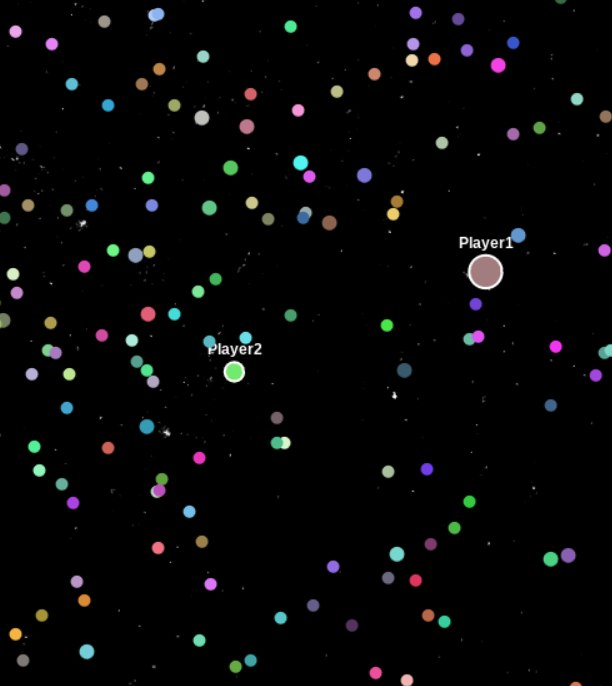

# Agar Clone

This project is a basic clone of a famous multiplayer browser game, featuring both the client and server components. It's built using Node.js, socket.io, and Express.




## Features

- Basic multiplayer browser game.
- Real-time multiplayer functionality using socket.io.
- socket.io admin panel.
- Customizable game parameters through environment variables.
- Development mode with auto-reloading using Nodemon.

## Installation

To run it locally:

1. Clone this repository to your local machine.

2. Install the required dependencies using npm (Node Package Manager).
   ```sh
   npm install
   ```

3. Create a `.env` file in the root directory for environment variables. You can use the following example as a template:
   ```env
   PORT=9001
   WORLD_HEIGHT=1000
   WORLD_WIDTH=1000
   ORB_COUNT=500
   DEFAULT_SPEED=6
   DEFAULT_SIZE=6
   DEFAULT_ZOOM=1.5
   NODE_ENV=development
   ADMIN_PORT=9002
   ADMIN_PASSWORD=testtest
   ```
    **NOTE:** The `ADMIN_PORT` and `ADMIN_PASSWORD` variables are only required if you want to use the admin panel. It's enabled only in the development mode, which is controlled by `NODE_ENV` variable.

4. Start the server using the following command:
   ```sh
   npm start
   ```

    *If you want to work on the project while making changes, you can use the development mode with auto-reloading:*

    ```sh
    npm run dev
    ```

## Usage

Once you have the server up and running, you can access the game by opening your browser and navigating to `http://localhost:9001`. The game provides a multiplayer environment where players can interact, compete, and enjoy the gameplay.

## Configuration

The game can be configured using the environment variables in the `.env` file. Here are some important variables you can customize:

- `PORT`: The port on which the game server will run.
- `WORLD_HEIGHT` and `WORLD_WIDTH`: Dimensions of the game world.
- `ORB_COUNT`: Number of orbs available in the game.
- `DEFAULT_SPEED`, `DEFAULT_SIZE`, and `DEFAULT_ZOOM`: Initial game settings.
- `NODE_ENV`: Set to `development` for development mode.
- `ADMIN_PORT` and `ADMIN_PASSWORD`: Configuration for the admin panel.
